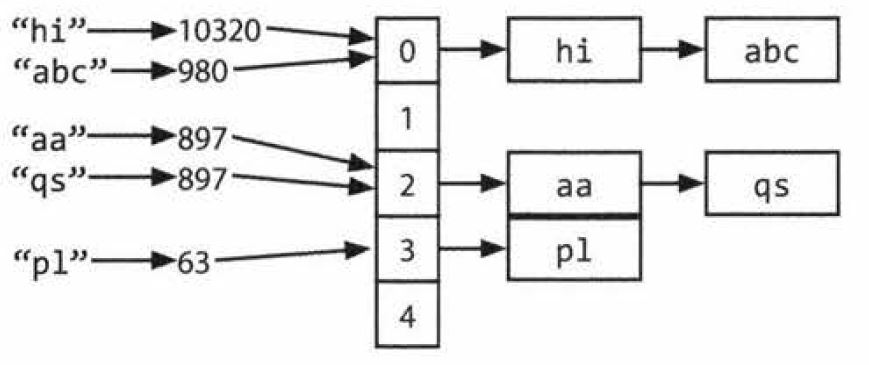

## HashTables

A hash table is a data structure that maps keys to values for highly efficient lookup. There are a number of
ways of implementing this. Here, we will describe a simple but common implementation.
In this simple implementation, we use an array of linked lists and a hash co.de function. To insert a key
(which might be a string or essentially any other data type) and value, we do the following:

    1. First, compute the key's hash code, which will usually be an int or long. Note that two different keys
    could have the same hash code, as there may be an infinite number of keys and a finite number of ints.

    2. Then, map the hash code to an index in the array. This could be done with something like hash (key)
    % array_length. Two different hash codes could, of course, map to the same index.

    3. At this index, there is a linked list of keys and values. Store the key and value in this index. We must use a
    linked list because of collisions: you could have two different keys with the same hash code, or two different
    hash codes that map to the same index.

To retrieve the value pair by its key, you repeat this process. Compute the hash code from the key, and then
compute the index from the hash code. Then, search through the linked list for the value with this key.
If the number of collisions is very high, the worst case runtime is O( N), where N is the number of keys.
However, we generally assume a good implementation that keeps collisions to a minimum, in which case
the lookup time is a (1).

Alternatively, we can implement the hash table with a balanced binary search tree. This gives us an O( log N)
lookup time. The advantage of this is potentially using less space, since we no longer allocate a large array. We
can also iterate through the keys in order, which can be useful sometimes.